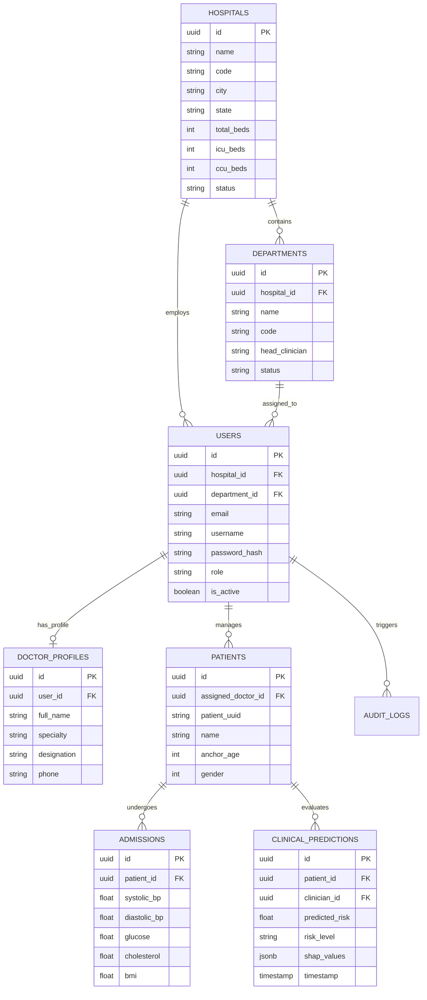

<div align="center">

# 🫀 AI-Powered Coronary Heart Disease Clinical Decision Support System (AI-CHD-CDSS).

### *An Enterprise-Grade, Explainable AI Clinical Co-Pilot for Cardiovascular Risk Stratification & Hospital Governance*

[](https://chd-frontend.onrender.com)
[](https://chd-backend-pqwe.onrender.com/docs)
[](https://github.com/tulasiram04/AI-CHD-CDSS)

<br/>

[](https://fastapi.tiangolo.com/)
[](https://nextjs.org/)
[](https://www.typescriptlang.org/)
[](https://www.postgresql.org/)
[](https://www.python.org/)
[](https://catboost.ai/)
[](https://shap.readthedocs.io/)
[](https://www.docker.com/)
[](LICENSE)

</div>

---

> [!IMPORTANT]
> **Clinical Governance & Safety Notice**: AI-CHD-CDSS is engineered strictly as an evidence-based **Clinical Decision Support System** to assist cardiologists, intensive care specialists, and hospital ward teams. It serves as an intelligent clinical co-pilot and does not replace professional diagnostic judgment, direct physical examination, or primary attending physician care.

---

## 📋 Table of Contents

- [1. Executive Summary](#-1-executive-summary)
- [2. Comprehensive Platform Portals & Features](#-2-comprehensive-platform-portals--features)
  - [2.1 Doctor Portal & Clinical Decision Co-Pilot](#21-doctor-portal--clinical-decision-co-pilot)
  - [2.2 Super Admin Portal & Executive Intelligence](#22-super-admin-portal--executive-intelligence)
- [3. Clinical & Mathematical Rationale](#-3-clinical--mathematical-rationale)
- [4. Machine Learning & Explainable AI (XAI) Pipeline](#-4-machine-learning--explainable-ai-xai-pipeline)
  - [4.1 Ensemble ML Architecture](#41-ensemble-ml-architecture)
  - [4.2 Probability Calibration (Platt Scaling & Isotonic Regression)](#42-probability-calibration-platt-scaling--isotonic-regression)
  - [4.3 SHAP Feature Attribution Theory](#43-shap-feature-attribution-theory)
  - [4.4 Clinical Reference Validation Rules](#44-clinical-reference-validation-rules)
- [5. Dataset Specifications & Feature Schema](#-5-dataset-specifications--feature-schema)
- [6. System Architecture & Component Design](#-6-system-architecture--component-design)
- [7. Database Schema & Entity Relationship Diagram (ERD)](#-7-database-schema--entity-relationship-diagram-erd)
- [8. Directory Structure & File Map](#-8-directory-structure--file-map)
- [9. Complete REST API Reference](#-9-complete-rest-api-reference)
- [10. Hospital PDF Chart Generator](#-10-hospital-pdf-chart-generator)
- [11. Installation & Local Setup Guide](#-11-installation--local-setup-guide)
- [12. Testing, Code Quality & CI/CD](#-12-testing-code-quality--cicd)
- [13. Cloud Deployment Blueprint (Render)](#-13-cloud-deployment-blueprint-render)
- [14. License & Author Specifications](#-14-license--author-specifications)

---

## 🏥 1. Executive Summary

**Coronary Heart Disease (CHD)** remains the leading cause of global mortality. Early, accurate 10-year risk estimation allows clinicians to deploy targeted primary prevention strategies—such as statin therapy, blood pressure optimization, and lifestyle modification—before irreversible adverse cardiovascular events occur.

**AI-CHD-CDSS** bridges the gap between complex biomedical machine learning and bedside clinical practice. Built with **Next.js 16**, **FastAPI**, **PostgreSQL 16**, **CatBoost Ensemble Learning**, and **SHAP (SHapley Additive exPlanations)**, the platform delivers:

1. **Precision Risk Stratification**: Computes continuous 10-year CHD risk probabilities ($0.0\% - 100.0\%$) and categorizes patients into 5 distinct clinical risk tiers.
2. **Transparent Explainability**: Unpacks model predictions via itemized SHAP attributions, identifying exact **Risk-Increasing Factors ($\mathbf{\Delta}$)** and **Protective Baseline Traits ($\mathbf{\nabla}$)**.
3. **Guideline-Driven Care Plans**: Automatically generates evidence-based ACC/AHA cardiovascular guidelines tailored to patient risk scores and comorbidity vectors.
4. **Enterprise Executive Governance**: Empowers hospital administrators with real-time population health analytics, multi-facility bed tracking (Total, ICU, CCU), department performance matrices, and multi-role user managements.

---

## 💻 2. Comprehensive Platform Portals & Features

```
                                  +---------------------------------------+
                                  |         AI-CHD-CDSS Platform          |
                                  +-------------------+-------------------+
                                                      |
                         +----------------------------+----------------------------+
                         |                                                         |
         +---------------v---------------+                         +---------------v---------------+
         |         Doctor Portal         |                         |       Super Admin Portal      |
         |   (Bedside Decision Support)  |                         |   (Executive Health Governance)|
         +---------------+---------------+                         +---------------+---------------+
                         |                                                         |
        ┌────────────────┴────────────────┐                       ┌────────────────┴────────────────┐
        │ • Patient Registration & EHR    │                       │ • Executive Clinical Intelligence│
        │ • AI 10-Yr CHD Risk Calculator  │                       │ • Multi-Hospital Management     │
        │ • SHAP Explainable AI Matrix    │                       │ • Department & Ward Allocation  │
        │ • ACC/AHA Guideline Care Plan   │                       │ • Doctor & User Account Admin   │
        │ • Exportable Hospital PDF Chart │                       │ • Real-Time Security & MFA Hub  │
        └─────────────────────────────────┘                       └─────────────────────────────────┘
```

### 2.1 Doctor Portal & Clinical Decision Co-Pilot

- **Dynamic AI Prediction Engine (`/doctor/predict`)**:
  - Calculates model-driven 10-year CHD risk probabilities without hardcoded or synthetic fallback percentages.
  - Supports dual input methods: **Manual Parameter Entry** or **Instant ICU Patient Lookup** from hospital EHR database.
- **Explainable AI (SHAP) Interpretation**:
  - Itemized feature attributions showing exact percentage impacts of each clinical parameter on the total risk score.
  - Clear separation of **Risk Drivers ($\mathbf{\Delta}$)** and **Protective Factors ($\mathbf{\nabla}$)**.
  - Enforces strict clinical reference boundaries so that normal values (e.g., Blood Pressure $<120/80\text{ mmHg}$, Fasting Glucose $<100\text{ mg/dL}$, Age $<60$) are **never** labeled as risk vectors.
- **ACC/AHA Clinical Guideline Synthesizer**:
  - Automatically recommends statin intensity (High-Intensity vs Moderate-Intensity Statin Therapy), blood pressure targets ($<130/80\text{ mmHg}$), HbA1c screening, lifestyle intervention, and urgent cardiology consultations.
- **Patient Registry & Consultation History (`/doctor/patients`, `/doctor/history`)**:
  - Full audit trail of past patient predictions, vitals trends, and diagnostic runs.
- **Hospital PDF Report Generator**:
  - Generates dense, multi-section clinical PDF charts with custom patient headers, color-coded risk gauges, SHAP breakdown tables, and clinician signature blocks.

---

### 2.2 Super Admin Portal & Executive Intelligence

- **Executive Clinical Intelligence Center (`/admin/clinical-analytics`)**:
  - Real-time population risk stratification breakdown (Very Low, Low, Moderate, High, Very High).
  - Disease burden distribution across active patient cohorts (Hypertension, Diabetes, Hyperlipidemia, Smoking, Obesity, Family History).
  - Data-driven department performance comparison (Active Patients, AI Predictions, Avg Risk %, Avg Blood Pressure, Avg Cholesterol, Avg BMI, Quality Scores).
  - Longitudinal risk trend charts across Daily, Weekly, Monthly, and Yearly intervals.
  - High-contrast, executive panel digest powered directly by PostgreSQL queries.
- **Hospital Network Management (`/admin/hospitals`)**:
  - Enterprise multi-hospital workspace provisioning and facility configuration.
  - Live bed capacity tracking (**Total Beds**, **ICU Beds**, **CCU Beds**).
  - Operational contact directory and emergency hotline governance.
- **Department & Ward Governance (`/admin/departments`)**:
  - Clinical department creation, head clinician assignment, and ward activity tracking.
- **Doctor & User Governance (`/admin/doctors`, `/admin/users`)**:
  - Account provisioning for doctors, super admins, auditors, and researchers.
  - Active status toggle, password reset, role assignment, and clinician profile management.
- **Global Patient EHR Registry (`/admin/patients`)**:
  - Universal patient directory synced in real time across Doctor and Admin portals.
- **Security Center & Audit Hub (`/admin/security`)**:
  - System-wide security status scoring, multi-factor authentication (MFA) enforcement, and immutable audit logging.

---

## 🔬 3. Clinical & Mathematical Rationale

The primary prediction target of AI-CHD-CDSS is the **10-year probability of developing Coronary Heart Disease**:

$$\mathbf{P(\text{CHD} = 1 \mid \mathbf{X}) = \sigma\left( f(\mathbf{X}) \right) = \frac{1}{1 + e^{-f(\mathbf{X})}}}$$

Where:
- $\mathbf{X} = \{x_1, x_2, \dots, x_n\}$ is the feature vector of patient clinical parameters.
- $f(\mathbf{X})$ is the ensembled decision score output by the trained **CatBoost / XGBoost** gradient boosted tree pipeline.
- $\sigma(z)$ is the sigmoid transformation calibrated via Platt Scaling.

### Physiological Risk Stratification Thresholds

```
   0.0%             5.0%            10.0%           20.0%           40.0%           100.0%
    ├─── Very Low ───┼───── Low ─────┼─── Moderate ──┼──── High ─────┼─── Very High ───┤
    │  (Green #10B981) (Green #059669) (Yellow #D97706) (Orange #EA580C) (Red #DC2626) │
```

---

## 🤖 4. Machine Learning & Explainable AI (XAI) Pipeline

```
Raw Clinical Telemetry
         │
         ▼
[Pandera Schema Validation] ──► Removes out-of-bound physiological anomalies
         │
         ▼
[Feature Engineering]      ──► Calculates Pulse Pressure, Non-HDL Cholesterol & Risk Ratios
         │
         ▼
[Optuna Hyperparameter Tuning] ──► Optimizes Tree Depth, L2 Regularization & Learning Rates
         │
         ▼
[CatBoost / XGBoost Ensemble] ──► Computes Raw Model Decision Function f(X)
         │
         ▼
[Platt / Isotonic Calibration]──► Produces Calibrated 10-Year Probability P(CHD = 1)
         │
         ▼
[SHAP Explainer Engine]     ──► Calculates Feature Attribution Values φ_i
         │
         ▼
[Clinical Validation Rules] ──► Enforces Reference Threshold Constraints
```

### 4.1 Ensemble ML Architecture

- **Primary Classifier**: CatBoost Classifier & XGBoost Ensemble
- **Validation ROC-AUC**: `0.763`
- **Cross-Validation ROC-AUC**: `0.758`
- **Inference Latency**: `< 20 ms`
- **Hyperparameter Optimization**: **Optuna** (100 trials optimizing log-loss and ROC-AUC).

---

### 4.2 Probability Calibration (Platt Scaling & Isotonic Regression)

Standard decision tree ensembles often output uncalibrated probabilities that cluster near 0 or 1. To provide reliable clinical probabilities, AI-CHD-CDSS applies **Platt Scaling**:

$$P_{\text{calibrated}}(y = 1 \mid f(\mathbf{X})) = \frac{1}{1 + \exp\left( A \cdot f(\mathbf{X}) + B \right)}$$

Where parameters $A$ and $B$ are fitted via maximum likelihood estimation on out-of-fold validation sets.

---

### 4.3 SHAP Feature Attribution Theory

To eliminate "black-box" decision making in critical care, AI-CHD-CDSS integrates **SHAP (SHapley Additive exPlanations)** based on cooperative game theory:

$$\phi_i(v) = \sum_{S \subseteq N \setminus \{i\}} \frac{|S|! \; (|N| - |S| - 1)!}{|N|!} \left[ v(S \cup \{i\}) - v(S) \right]$$

Where:
- $\phi_i$ is the SHAP contribution value for clinical feature $i$.
- $N$ is the set of all input features.
- $S$ is a subset of features acting as a coalition.
- $v(S)$ is the model expectation given feature subset $S$.

The final model output probability is decomposed into:

$$f(\mathbf{X}) = \phi_0 + \sum_{i=1}^{n} \phi_i$$

Where $\phi_0$ is the base expected value across the training population.

---

### 4.4 Clinical Reference Validation Rules

To preserve clinical credibility, raw SHAP attributions are post-processed against clinical guidelines:

1. **Risk Increasing Driver ($\mathbf{\Delta}$)**:
   - Feature SHAP value $\phi_i > 0$ **AND** parameter value exceeds abnormal clinical cutoff (e.g., Systolic BP $\ge 130\text{ mmHg}$, Fasting Glucose $\ge 100\text{ mg/dL}$, Age $\ge 60$).
2. **Protective Factor ($\mathbf{\nabla}$)**:
   - Feature SHAP value $\phi_i \le 0$ **OR** parameter value is within normal physiological limits (e.g., Young age $<45$, Normal BP $<120/80\text{ mmHg}$, Normal Cholesterol $<200\text{ mg/dL}$).
3. **Rule Guarantee**: Normal physiological values are **never** presented to the clinician as risk drivers.

---

## 📊 5. Dataset Specifications & Feature Schema

### Primary Sources
- **Dataset Name**: Heart Disease Dataset & MIMIC-IV Clinical Database v2.2
- **Primary Repository**: [UCI Machine Learning Repository - Heart Disease](https://archive.uci.edu/ml/datasets/heart+disease)
- **Secondary Source**: MIMIC-IV ICU Cohort Records

### Feature Specifications Table

| Feature Name | Python Type | Unit / Range | Clinical Reference Range | Abnormal Threshold |
| :--- | :--- | :--- | :--- | :--- |
| `age` | `int` | $18 - 100\text{ yrs}$ | $< 50\text{ yrs}$ | $\ge 60\text{ yrs}$ |
| `gender` | `int` | `0=Female, 1=Male` | - | - |
| `bmi` | `float` | $12.0 - 60.0\text{ kg/m}^2$ | $18.5 - 24.9\text{ kg/m}^2$ | $\ge 25.0\text{ kg/m}^2$ (Overweight/Obese) |
| `systolic_bp` | `float` | $70 - 240\text{ mmHg}$ | $90 - 119\text{ mmHg}$ | $\ge 130\text{ mmHg}$ (Hypertension) |
| `diastolic_bp` | `float` | $40 - 140\text{ mmHg}$ | $60 - 79\text{ mmHg}$ | $\ge 80\text{ mmHg}$ |
| `glucose` | `float` | $50 - 500\text{ mg/dL}$ | $70 - 99\text{ mg/dL}$ | $\ge 100\text{ mg/dL}$ (Impaired / Diabetic) |
| `cholesterol` | `float` | $80 - 600\text{ mg/dL}$ | $< 200\text{ mg/dL}$ | $\ge 200\text{ mg/dL}$ (Hyperlipidemia) |
| `heart_rate` | `float` | $30 - 220\text{ bpm}$ | $60 - 100\text{ bpm}$ | $> 100\text{ bpm}$ (Tachycardia) |
| `hypertension` | `int` | `0=No, 1=Yes` | `0` | `1` |
| `diabetes` | `int` | `0=No, 1=Yes` | `0` | `1` |
| `smoking` | `int` | `0=No, 1=Yes` | `0` | `1` |
| `previous_cardiac`| `int` | `0=No, 1=Yes` | `0` | `1` |
| `statin_history` | `int` | `0=No, 1=Yes` | `0` | `1` |
| `icu_admissions` | `int` | $\ge 0$ | `0` | $\ge 1$ |

---

## 🏗️ 6. System Architecture & Component Design

```
                                  +---------------------------------------+
                                  |         NGINX / Render Proxy          |
                                  |           (Port 80 / 443)             |
                                  +-------------------+-------------------+
                                                      |
                         +----------------------------+----------------------------+
                         |                                                         |
         +---------------v---------------+                         +---------------v---------------+
         |     Next.js 16 Web Portal     |                         |        FastAPI Backend        |
         |     (App Router, React 19)    |                         |      (Python 3.12, Uvicorn)   |
         +-------------------------------+                         +---------------+---------------+
                                                                                   |
                                                     +-----------------------------+-----------------------------+
                                                     |                             |                             |
                                      +--------------v--------------+ +------------v------------+ +--------------v--------------+
                                      |     PostgreSQL Database     | |   MLflow & SHAP Engine  | |      Audit & PDF Engine     |
                                      |   (Users, Patients, Vitals) | | (CatBoost, Calibration) | |    (jsPDF, Event Bus Logs)  |
                                      +-----------------------------+ +-------------------------+ +-----------------------------+
```

---

## 🗄️ 7. Database Schema & Entity Relationship Diagram (ERD)



---

## 📁 8. Directory Structure & File Map

```
AI-CHD-CDSS/
├── .github/
│   └── workflows/
│       └── ci_cd.yml                 # Automated GitHub Actions CI/CD Pipeline
├── backend/
│   ├── database/
│   │   ├── connection.py             # SQLAlchemy 2.0 Engine & Session Local
│   │   └── models.py                 # ORM Models (User, Hospital, Patient, Prediction, Audit)
│   ├── migrations/
│   │   ├── env.py                    # Alembic Environment Migration Script
│   │   └── versions/                 # Database Schema Migration Versioning
│   ├── scripts/
│   │   └── seed_db.py                # Data Seeder for System Roles, Admin Accounts & Demo Data
│   ├── services/
│   │   ├── audit_service.py          # Immutable Security Audit Logger
│   │   ├── clinical_intelligence_service.py # PostgreSQL Population Health Analytics Engine
│   │   ├── hospital_service.py       # Multi-Hospital Facility & Bed Allocation Service
│   │   ├── notification_service.py   # Real-Time In-App Alert Broadcast Engine
│   │   ├── patient_analytics_service.py # Patient Cohort & Risk Distribution Service
│   │   └── user_management_service.py# RBAC User Provisioning & Password Reset Service
│   ├── tests/
│   │   ├── test_admin_api.py         # Pytest Suite for Super Admin Endpoints
│   │   ├── test_auth.py              # Pytest Suite for JWT Login & Security
│   │   └── test_predictions.py       # Pytest Suite for ML Risk Inference & SHAP Engine
│   ├── admin.py                      # Super Admin Portal API Router
│   ├── auth.py                       # User Authentication & Signup Router
│   ├── main.py                       # FastAPI Master Application Entry Point
│   ├── predictions.py                # Machine Learning Risk Prediction & SHAP Router
│   ├── security.py                   # Password Hashing & JWT Token Utilities
│   └── requirements.txt              # Production Python Backend Dependencies
├── frontend/
│   ├── src/
│   │   ├── app/
│   │   │   ├── admin/                # Super Admin Portal Pages (Analytics, Hospitals, Users, Security)
│   │   │   ├── doctor/               # Doctor Portal Pages (Predict, Patients, History)
│   │   │   ├── page.tsx              # Public Landing Page & System Portal Directory
│   │   │   └── layout.tsx            # Next.js Master Root Layout
│   │   ├── components/               # Reusable Glassmorphism UI Components
│   │   └── lib/
│   │       ├── api.ts                # Axios Interceptor with JWT Auth Injection
│   │       └── pdfGenerator.ts       # jsPDF Clinical Hospital Chart Export Engine
│   ├── package.json                  # Frontend Node.js Dependencies
│   └── tsconfig.json                 # TypeScript Configuration
├── docker-compose.yml                # Docker Multi-Container Orchestration Blueprint
├── render.yaml                       # Render Infrastructure Cloud Blueprint
└── README.md                         # Project Master Documentation
```

---

## 🌐 9. Complete REST API Reference

### Authentication Endpoints
| Method | Path | Description | Access Permission |
| :--- | :--- | :--- | :--- |
| `POST` | `/api/v1/auth/login` | Authenticates email & password, returns JWT token | Public |
| `POST` | `/api/v1/auth/signup` | Registers new clinician account | Public |
| `GET` | `/api/v1/auth/me` | Fetches active user session profile | Authenticated |

### Clinical Prediction Endpoints
| Method | Path | Description | Access Permission |
| :--- | :--- | :--- | :--- |
| `POST` | `/api/v1/predict/direct` | Computes ML 10-yr CHD risk score & SHAP explanation | Doctor, Admin |
| `POST` | `/api/v1/predict/admission/{id}` | Calculates risk score from ICU admission record | Doctor, Admin |

### Super Admin Executive Endpoints
| Method | Path | Description | Access Permission |
| :--- | :--- | :--- | :--- |
| `GET` | `/api/v1/admin/clinical-intelligence` | Returns live population risk metrics, disease burden, and hospital KPIs | Super Admin |
| `GET` | `/api/v1/admin/hospitals` | Lists registered hospital facilities and bed allocations | Super Admin |
| `GET` | `/api/v1/admin/hospitals/{id}` | Fetches detailed hospital inspection telemetry | Super Admin |
| `PUT` | `/api/v1/admin/hospitals/{id}` | Updates hospital configuration & bed capacity | Super Admin |
| `GET` | `/api/v1/admin/departments` | Lists clinical departments and head clinicians | Super Admin |
| `POST` | `/api/v1/admin/departments` | Creates a new clinical department | Super Admin |
| `GET` | `/api/v1/admin/users` | Lists user accounts with filters | Super Admin |
| `POST` | `/api/v1/admin/users` | Provisions new doctor or admin account | Super Admin |
| `PUT` | `/api/v1/admin/users/{id}/status` | Toggles user active/inactive status | Super Admin |

---

## 📄 10. Hospital PDF Chart Generator

The built-in client PDF engine (`frontend/src/lib/pdfGenerator.ts`) generates dense, 2-page hospital chart documents:

1. **Hospital Header & Patient Banner**: Patient UUID, Admission ID, Biological Sex, Age, Date Stamp.
2. **Model Risk Stratification Gauge**: 10-Year CHD Probability Score, Color-Coded Risk Level Badge, Validation Score.
3. **Clinical Interpretation Narrative**: Detailed medical synthesis summarizing physiological parameters.
4. **SHAP Feature Attribution Table**: Itemized breakdown of positive risk drivers vs protective baseline traits.
5. **ACC/AHA Clinical Guidelines Care Plan**: Recommended statin intensity, blood pressure targets, lifestyle counseling, and follow-up schedules.
6. **Clinician Signature Block**: Official sign-off block for attending physician signature.

---

## 🚀 11. Installation & Local Setup Guide

### Prerequisites
- **Python**: `3.12+`
- **Node.js**: `20.x+`
- **PostgreSQL**: `16.x`

---

### Step 1: Clone Repository
```bash
git clone https://github.com/tulasiram04/AI-CHD-CDSS.git
cd AI-CHD-CDSS
```

---

### Step 2: Set Up Backend Environment

```bash
# Create Python virtual environment
python -m venv venv

# Activate environment
# Windows:
venv\Scripts\activate
# Linux / macOS:
source venv/bin/activate

# Install backend dependencies
pip install -r backend/requirements.txt

# Run database schema migrations
alembic -c backend/alembic.ini upgrade head

# Seed initial system structure & admin accounts
python backend/scripts/seed_db.py

# Launch FastAPI development server
uvicorn backend.main:app --host 0.0.0.0 --port 8000 --reload
```
Interactive Swagger API Documentation will be available at: **`http://localhost:8000/docs`**

---

### Step 3: Set Up Frontend Portal

```bash
cd frontend

# Install Node modules
npm install

# Launch Next.js development server
npm run dev
```
Web Application will be available at: **`http://localhost:3000`**

---

### Step 4: Docker Multi-Container Launch (Optional)

```bash
docker compose up --build -d
```

---

## 🧪 12. Testing, Code Quality & CI/CD

The project features a **GitHub Actions CI/CD Pipeline** (`.github/workflows/ci_cd.yml`) that validates code quality on every push:

```bash
# Run Pytest backend test suite
python -m pytest backend/tests/

# Verify TypeScript compilation in frontend
cd frontend
npx tsc --noEmit
```

---

## ☁️ 13. Cloud Deployment Blueprint (Render)

The repository includes a production **Render Blueprint (`render.yaml`)**:

1. Connect your GitHub repository to [Render](https://render.com).
2. Create a new **Blueprint Deployment**.
3. Render automatically provisions:
   - **FastAPI Web Service**: `chd-backend`
   - **Next.js Web Service**: `chd-frontend`
4. Configure environment variables in the Render Dashboard:
   - `DATABASE_URL`: PostgreSQL Connection String
   - `JWT_SECRET_KEY`: Secret Key for JWT Authentication

---

## 📜 14. License & Author Specifications

### Project Author
- **Author**: Tulasiram
- **GitHub**: [@tulasiram04](https://github.com/tulasiram04)
- **Repository**: [AI-CHD-CDSS Repository](https://github.com/tulasiram04/AI-CHD-CDSS)

### License
This software is open-source licensed under the **[MIT License](LICENSE)**.

---

<div align="center">
  <sub>Built with ❤️ for Cardiovascular Medicine & Clinical Decision Support.</sub>
</div>
