# Role-Based Access Control (RBAC) Mermaid Representation

This document contains a structured Mermaid diagram visualizing the Role-Based Access Control (RBAC) Matrix for the CDSS platform.

## RBAC Matrix Mermaid Class Diagram

```mermaid
classDiagram
    direction LR

    class SuperAdmin {
        +Login: ✅
        +Dashboard: ✅
        +View Patient Registry: ✅
        +Register New Patient: ✅
        +Edit Patient Details: ✅
        +View Patient Details: ✅
        +Update Vitals: ✅
        +Upload Lab Results: ✅
        +Upload ECG: ✅
        +Upload Radiology Reports: ✅
        +Run CHD Prediction: ✅
        +View Prediction Results: ✅
        +View SHAP Explainability: ✅
        +Clinical Recommendations: ✅
        +Prediction History: ✅
        +Generate / Download Reports: ✅
        +Approve Staff Registration: ✅
        +View Pending Registration Requests: ✅
        +Create Doctor Accounts: ✅
        +Manage Users & Roles: ✅
        +Manage Hospitals & Departments: ✅
        +Upload Training Dataset: ✅
        +Retrain AI Model: ✅
        +Deploy / Rollback Model: ✅
        +Model Registry: ✅
        +Audit Logs: ✅
        +System Monitoring: ✅
        +Backup & Restore: ✅
        +Platform Settings: ✅
    }

    class Doctor {
        +Login: ✅
        +Dashboard: ✅
        +View Patient Registry: ✅
        +Register New Patient: ✅
        +Edit Patient Details: ✅
        +View Patient Details: ✅
        +Update Vitals: ✅
        +Upload Lab Results: ✅
        +Upload ECG: ✅
        +Upload Radiology Reports: ✅
        +Run CHD Prediction: ✅
        +View Prediction Results: ✅
        +View SHAP Explainability: ✅
        +Clinical Recommendations: ✅
        +Prediction History: ✅
        +Generate / Download Reports: ✅
        +Approve Staff Registration: ✅
        +View Pending Registration Requests: ✅
        +Model Registry: View
        +Audit Logs: Own Activity
    }

    class Nurse {
        +Login: ✅
        +Dashboard: ✅
        +View Patient Registry: ✅
        +Register New Patient: ✅
        +Edit Patient Details: Limited
        +View Patient Details: ✅
        +Update Vitals: ✅
        +Upload Lab Results: View
        +Upload ECG: View
        +Upload Radiology Reports: View
        +Run CHD Prediction: View Only
        +View Prediction Results: ✅
        +View SHAP Explainability: View
        +Clinical Recommendations: View
        +Prediction History: View
        +Generate / Download Reports: View
    }

    class LabTechnician {
        +Login: ✅
        +Dashboard: ✅
        +View Patient Registry: Assigned Patients
        +View Patient Details: Assigned Patients
        +Upload Lab Results: ✅
        +View Prediction Results: View
        +Generate / Download Reports: View
    }

    class ECGTechnician {
        +Login: ✅
        +Dashboard: ✅
        +View Patient Registry: Assigned Patients
        +View Patient Details: Assigned Patients
        +Upload ECG: ✅
        +View Prediction Results: View
        +Generate / Download Reports: View
    }

    class RadiologyTechnician {
        +Login: ✅
        +Dashboard: ✅
        +View Patient Registry: Assigned Patients
        +View Patient Details: Assigned Patients
        +Upload Radiology Reports: ✅
        +View Prediction Results: View
        +Generate / Download Reports: View
    }

    class MedicalResearcher {
        +Login: ✅
        +Dashboard: ✅
        +View Patient Registry: De-identified Data
        +View Patient Details: Limited
        +Run CHD Prediction: View Results
        +View Prediction Results: ✅
        +View SHAP Explainability: ✅
        +Clinical Recommendations: View
        +Prediction History: Limited
        +Generate / Download Reports: Export
        +Model Registry: View
    }

    class Pharmacist {
        +Login: ✅
        +Dashboard: ✅
        +View Patient Registry: Assigned Patients
        +View Patient Details: Assigned Patients
        +View Prediction Results: View
        +Clinical Recommendations: View
        +Generate / Download Reports: View
    }

    class Physiotherapist {
        +Login: ✅
        +Dashboard: ✅
        +View Patient Registry: Assigned Patients
        +View Patient Details: Assigned Patients
        +View Prediction Results: View
        +Clinical Recommendations: View
        +Generate / Download Reports: View
    }

    class Dietitian {
        +Login: ✅
        +Dashboard: ✅
        +View Patient Registry: Assigned Patients
        +View Patient Details: Assigned Patients
        +View Prediction Results: View
        +Clinical Recommendations: View
        +Generate / Download Reports: View
    }
```



## Module-Based Permissions Matrix

Alternatively, permissions can be represented as modules containing the respective access level mappings.

```mermaid
mindmap
  root((CDSS RBAC Matrix))
    Clinical Operations
      Login: All Roles
      Dashboard: All Roles
      View Patient Registry: Super Admin, Doctor, Nurse, Technicians (Assigned), Pharmacist/Physio/Dietitian (Assigned), Researcher (De-identified)
      Register New Patient: Super Admin, Doctor, Nurse
      Edit Patient Details: Super Admin, Doctor, Nurse (Limited)
      View Patient Details: Super Admin, Doctor, Nurse, Technicians (Assigned), Pharmacist/Physio/Dietitian (Assigned), Researcher (Limited)
      Update Vitals: Super Admin, Doctor, Nurse
    Diagnostics & Vitals
      Upload Lab Results: Super Admin, Doctor, Lab Tech
      Upload ECG: Super Admin, Doctor, ECG Tech
      Upload Radiology Reports: Super Admin, Doctor, Radiology Tech
    CHD Clinical AI
      Run CHD Prediction: Super Admin, Doctor, Nurse (View), Researcher (View Results)
      View Prediction Results: All Roles
      View SHAP Explainability: Super Admin, Doctor, Nurse (View), Researcher
      Clinical Recommendations: Super Admin, Doctor, Nurse (View), Researcher (View), Pharmacist/Physio/Dietitian (View)
      Prediction History: Super Admin, Doctor, Nurse (View), Researcher (Limited)
      Generate & Download Reports: All Roles
    Administrative
      Approve Staff Registration: Super Admin, Doctor
      View Pending Registration: Super Admin, Doctor
      Create Doctor Accounts: Super Admin
      Manage Users & Roles: Super Admin
      Manage Hospitals & Departments: Super Admin
    MLOps & Engineering
      Upload Training Dataset: Super Admin
      Retrain AI Model: Super Admin
      Deploy / Rollback Model: Super Admin
      Model Registry: Super Admin, Doctor (View), Researcher (View)
    System Management
      Audit Logs: Super Admin, Doctor (Own Activity)
      System Monitoring: Super Admin
      Backup & Restore: Super Admin
      Platform Settings: Super Admin
```
